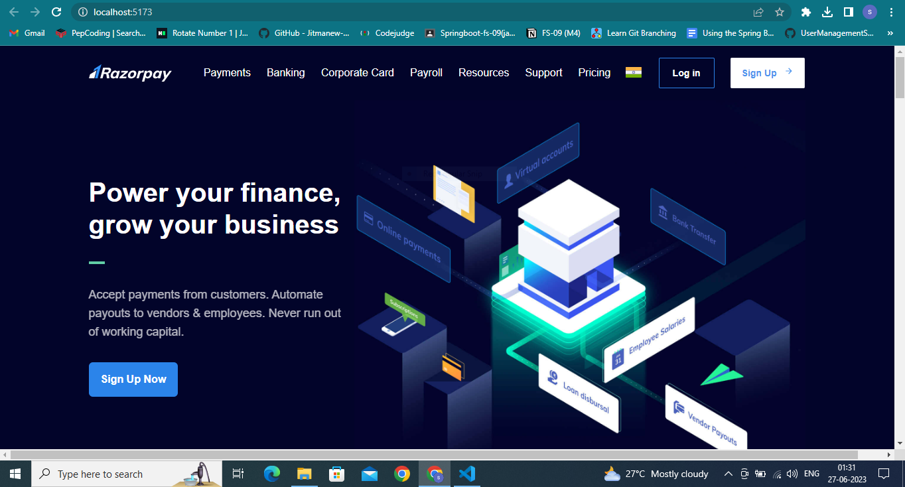

# Razorpay Home Page Clone

## Description

This project is a clone of the Razorpay home page. It aims to replicate the design and layout of the original Razorpay website using HTML and Tailwind CSS.

## Technologies Used

- HTML
- Tailwind CSS

## Installation

1. Clone the repository: `git clone https://github.com/suvadipmajhi1997/razorpay-homepage-clone.git`
2. Navigate to the project directory: `cd razorpay-homepage-clone`
3. Open the index.html file in your preferred web browser.

## Usage

The cloned Razorpay home page serves as a demonstration of frontend development skills using HTML and Tailwind CSS. It showcases the ability to recreate a complex design and implement responsive styling.

## Contributing

Contributions are welcome! If you have any suggestions, bug reports, or feature requests, please open an issue or submit a pull request. Ensure that you follow the project's code of conduct.

## License

This project is licensed under the [MIT License](LICENSE).

## Contact

For any questions or inquiries, feel free to reach out:

- Name: Suvadip Majhi
- LinkedIn: [LinkedIn Profile](https://www.linkedin.com/in/suvadipmajhi)
- Email: suvadipmjhi.official.1997@gmail.com

